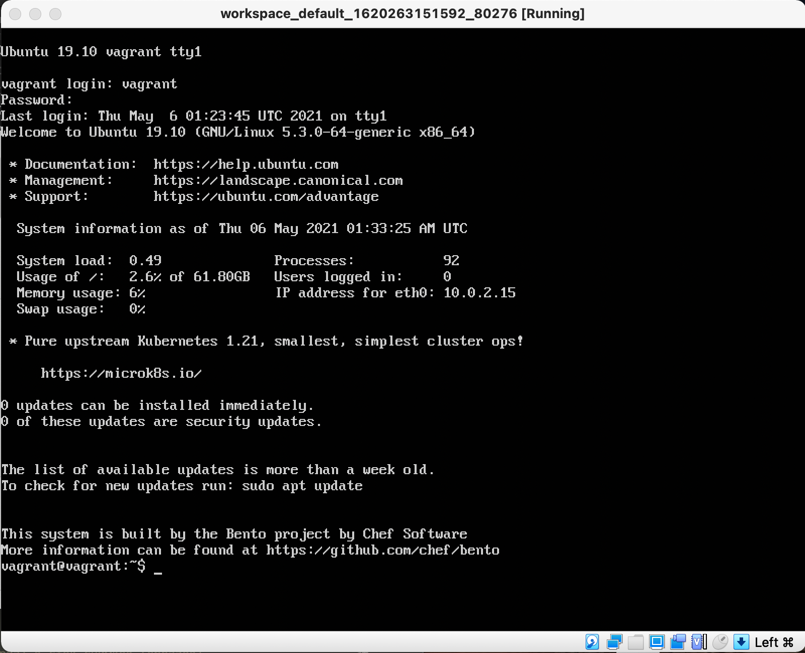
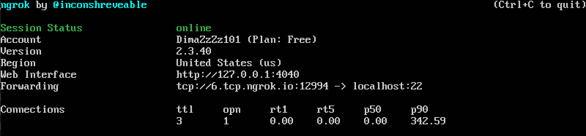
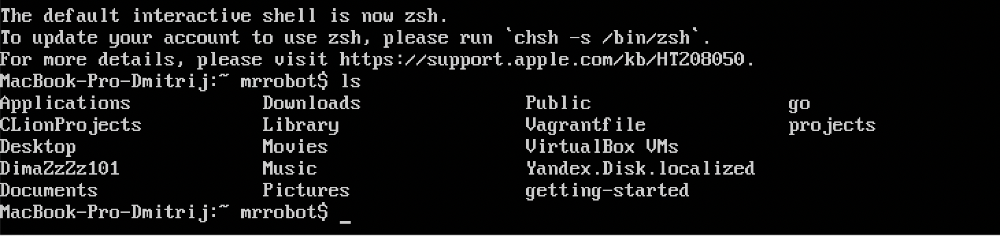

## Laboratory work XI

<a href="https://yandex.ru/efir/?stream_id=v7c2Ou7bACc8"></a>

Данная лабораторная работа посвещена изучению процесса создания сеансов совместной разработки с использованием инструмента **ngrok**

```sh
$ open https://ngrok.com/
```

## Tasks

- [x] 1. Ознакомиться со ссылками учебного материала
- [x] 2. Выполнить инструкцию учебного материала
- [x] 3. Составить отчет и отправить ссылку личным сообщением в **Slack**

## Tutorial

```sh
# Переходим в корневой каталог
$ cd ~

# В нем создаем директорию install
$ mkdir install

# Также создаем директорию tmp
$ mkdir tmp

# Задаем локальную переменную HOME_PREFIX
$ export HOME_PREFIX=`pwd`/install

# Выведем значение этой переменной
$ echo $HOME_PREFIX

/home/qt-legion/install

# Задаем локальную перменную USERNAME
$ export USERNAME=mrrobot
```

```sh
# Переходим в директорию tmp
$ cd tmp
```

```sh
# Скачиваем архив с библиотекой libevent, чтобы взаимодействовать с Libevent API 
$ wget https://github.com/libevent/libevent/releases/download/release-2.1.8-stable/libevent-2.1.8-stable.tar.gz

# Распаковываем архив и выводим его содержимое
$ tar -xvzf libevent-2.1.8-stable.tar.gz

# Переходим в требуемую директорию с библиотекой
$ cd libevent-2.1.8-stable

# Указываем директорию, в которую будет производится установка
$ ./configure --prefix=${HOME_PREFIX}

# Производим установку
$ make && make install

# Поднимаемся на директорию выше
$ cd ..
```

```sh
# Скачиваем архив с библиотекой ncures, чтобы иметь возможность управлять вводом выводом на терминал. 
# Также она позволяет программисту не беспокоиться об аппаратных различиях терминалов и писать достаточно переносимый код.
$ wget http://invisible-island.net/datafiles/release/ncurses.tar.gz

# Распаковываем архив и выводим его содержимое
$ tar -xvzf ncurses.tar.gz

# Переходим в требуемую директорию с библиотекой
$ cd ncurses-6.2

# Указываем директорию, в которую будет производится установка
$ ./configure --prefix=${HOME_PREFIX}

# Производим установку
$ make && make install

# Поднимаемся на директорию выше
$ cd ..
```


```sh
# Действия аналогичный предыдущим. Устанавливаем tmux.
# tmux — свободная консольная утилита-мультиплексор, предоставляющая пользователю доступ к нескольким терминалам в рамках одного экрана.
$ wget https://github.com/tmux/tmux/releases/download/2.5/tmux-2.5.tar.gz

$ tar -xvzf tmux-2.5.tar.gz

$ cd tmux-2.5

$ ./configure --prefix=${HOME_PREFIX} CFLAGS="-I${HOME_PREFIX}/include -I${HOME_PREFIX}/include/ncurses" LDFLAGS="-L${HOME_PREFIX}/lib"

$ make && make install

$ cd ..
```

```sh
# Скачиваем архив, содержащий ngrok
$ wget https://bin.equinox.io/c/4VmDzA7iaHb/ngrok-stable-linux-amd64.zip

# Установим unzip
$ brew install unzip

# Распаковываем скачаный архив
$ unzip ngrok-stable-linux-amd64.zip

# Перемещаем каталог с ngrok в директорию bin (полный путь: /home/qt-legion/install/bin)
$ mv ngrok ${HOME_PREFIX}/bin
```

```sh
# LD_LIBRARY_PATH -это предопределенная переменная среды в Linux/Unix, которая задает путь, по которому компоновщик должен искать при связывании динамических библиотек/общих библиотек.

# Задаем перемнные окружения для последующей работы
$ export LD_LIBRARY_PATH=${HOME_PREFIX}/lib
$ export PATH="${HOME_PREFIX}/bin:${PATH}"

# Запускаем tmux
$ tmux
```

```sh
# Возвращяемся в корневой каталог
$ cd ~

# Удаляем директории tmp и install
$ rm -rf tmp install
```

```sh
# Альтернативный способ установки tmux и ngrok
# (в одну строчку... (Т_Т))
$ brew install tmux ngrok # or use linuxbrew 🎉
```

```sh
# Создаем новую сессию
$ tmux new -s session_with_group
```

```sh

# Теперь необходимо поднять виртуалку, которую создавали в прошлой лабораторной

$ cd DimaZzZz101/workspace

$ vagrant up

# login: vagrant
# password: vagrant



```


```sh
# Alisa:
# Открываем сайт и регистрируемся
$ open https://ngrok.com/signup
# Задаем значению переменной значение токена
$ export NGROK_TOKEN=<токен>
# Указываем этот токен в качестве аутентификационного токена
$ ngrok authtoken ${NGROK_TOKEN}
# Указываем порт, чтобы получить доступ по SSH
$ ngrok tcp 22



# http://127.0.0.1:4040                             
# tcp://6.tcp.ngrok.io:12994 -> localhost:22 
```

```sh
# Bob:
# Работаем в виртуальной машине:
$ ssh ${USERNAME}@6.tcp.ngrok.io -p12994
<пароль_от_учетной_записи>


# Подключемся к созданной групповой сессии
$ tmux a -t session_with_group
# Вертикальное разделение консольного окна
$ <C-B>"
```
```sh

```
## Report

```sh
# Создание отчета
$ cd ~/workspace/
$ export LAB_NUMBER=11
$ git clone https://github.com/tp-labs/lab${LAB_NUMBER}.git tasks/lab${LAB_NUMBER}
$ mkdir reports/lab${LAB_NUMBER}
$ cp tasks/lab${LAB_NUMBER}/README.md reports/lab${LAB_NUMBER}/REPORT.md
$ cd reports/lab${LAB_NUMBER}
$ subl REPORT.md
$ gist REPORT.md
```

## Links

- [Tmux](https://raw.githubusercontent.com/tmux/tmux/master/README)
- [Libevent](http://libevent.org)
- [Ncurses](http://invisible-island.net/ncurses/)

```
Copyright (c) 2015-2020 The ISC Authors
```
